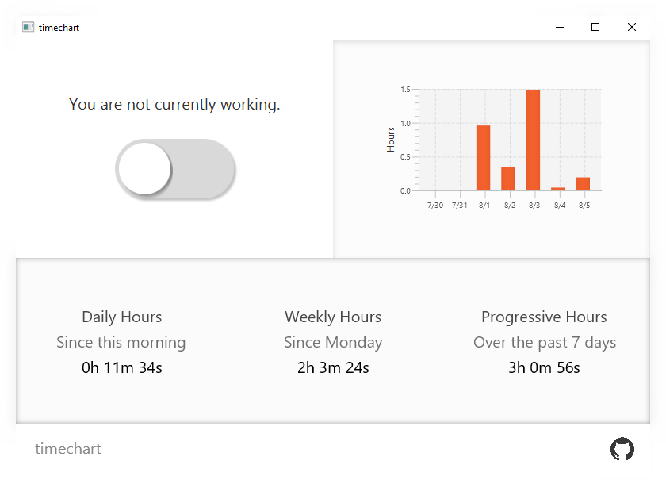

### timechart

---

Tracking work hours in Google Spreadsheets gets old after a while, so I decided to build an application to fix it. 
timechart will help you track your hours with ease! Toggle the slider when you start working, and untoggle it when you are finished.

### License

timechart is licensed under the MIT license.

### Libraries & Usage

timechart uses the following libraries:
- [JavaFX](https://github.com/openjdk/jfx), [licensed under GPL with the classpath exception](https://github.com/openjdk/jfx/blob/master/LICENSE)
- [Shadow](https://github.com/johnrengelman/shadow), [licensed under Apache 2.0](https://github.com/johnrengelman/shadow/blob/master/LICENSE)
- [GSON](https://github.com/google/gson), [licensed under Apache 2.0](https://github.com/google/gson/blob/master/LICENSE)